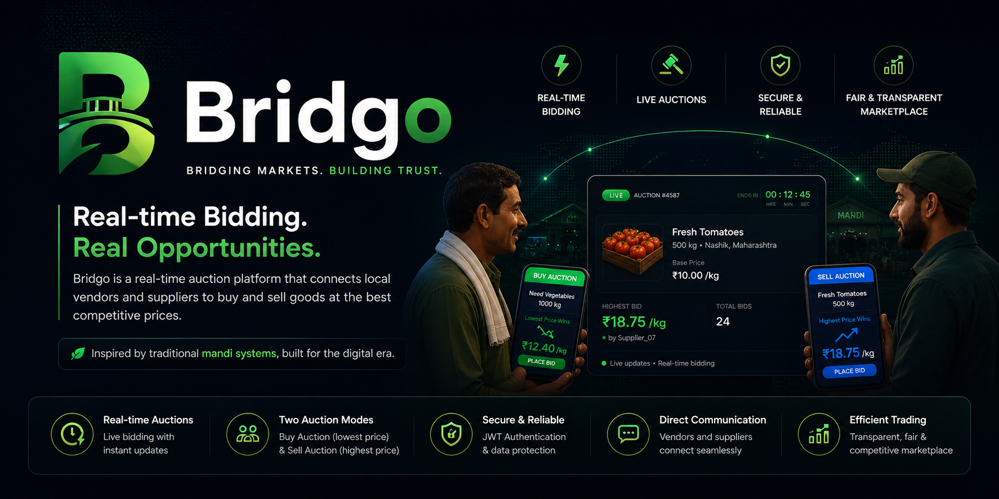

# 🚀 Bridgo 2.0

<p align="center">
  
</p>

<h3 align="center">
Bridging Local Vendors & Suppliers Through Real-Time Auctions
</h3>

<p align="center">
  A scalable real-time marketplace platform inspired by traditional Indian mandi systems.
</p>

---

<p align="center">


</p>

---

# 📌 Overview

**Bridgo 2.0** is a full-stack real-time auction platform that connects local street vendors with suppliers through live bidding systems, requirement matching, and location-aware commerce.

The platform modernizes traditional procurement systems by introducing:

* Real-time auctions
* Live bidding
* Vendor requirement management
* Supplier competition
* Location-based discovery
* Real-time notifications
* Geo-aware auction filtering

---

# 💡 Core Auction System

Bridgo introduces two marketplace flows inspired by traditional Indian mandi systems.

---

## 🟢 Buy Auction (Vendor Driven)

Vendors:

* Create procurement requests
* Specify quantity and requirements
* Start auctions for suppliers

Suppliers:

* Compete by offering the **lowest price**
* Respond directly to vendor requirements
* Win based on best offers

---

## 🔵 Sell Auction (Supplier Driven)

Suppliers:

* List available stock
* Create live auctions

Vendors:

* Participate in live bidding
* Compete by placing the **highest bid**
* Win based on auction price

---

# ✨ Features

## 👨‍🌾 Vendor Features

* Vendor authentication system
* Create procurement auctions
* Browse live supplier auctions
* Participate in real-time bidding
* Requirement submission system
* Order management system
* Location-based auction discovery
* Live auction participation

---

## 🚚 Supplier Features

* Supplier authentication system
* Create stock auctions
* Manage inventory listings
* Respond to vendor requirements
* Participate in vendor auctions
* Real-time auction management
* Auction scheduling system

---

## ⚡ Platform Features

* Real-time bidding using Socket.IO
* Live notifications system
* Auction scheduling engine
* Auto auction state transitions
* Dynamic location filtering
* Area & city based auction discovery
* Cloudinary image uploads
* Responsive dashboard UI
* Session-based authentication
* Real-time auction synchronization

---

# 🌍 Smart Location Architecture

Bridgo 2.0 uses a scalable geo-aware architecture.

The platform stores:

* State
* City
* Area / locality
* Latitude
* Longitude

This enables:

* Local supplier discovery
* Nearby auction filtering
* City-wise auction segmentation
* Scalable logistics support
* Future delivery optimization

---

# 🧠 Real-Time System

The platform uses Socket.IO powered room architecture.

## Auction Rooms

Used for:

* Live bidding
* Bid updates
* Auction events

## User Rooms

Used for:

* Personal notifications
* Realtime alerts
* Auction updates

---

# 🏗️ Tech Stack

| Layer            | Technology             |
| ---------------- | ---------------------- |
| Backend          | Node.js, Express.js    |
| Database         | MongoDB + Mongoose     |
| Frontend         | EJS, CSS, JavaScript   |
| Realtime Engine  | Socket.IO              |
| Authentication   | Express Sessions       |
| Media Storage    | Cloudinary             |
| Deployment Ready | Render / Railway / VPS |

---

# 📂 Project Structure

```bash
Bridgo/
│
├── app.js
├── routes/
├── models/
├── views/
├── public/
├── sockets/
├── services/
├── config/
├── middleware/
└── uploads/
```

---

# ⚙️ Installation & Setup

## 1️⃣ Clone Repository

```bash
git clone https://github.com/Tejwardeep-Singh/Bridgo2-Rawjet

cd Bridgo
```

---

## 2️⃣ Install Dependencies

```bash
npm install
```

---

## 3️⃣ Configure Environment Variables

Create a `.env` file in the root directory.

```env
MONGO_URI=your_mongodb_uri

PORT=5000

SESSION_SECRET=your_session_secret

CLOUDINARY_CLOUD_NAME=your_cloud_name
CLOUDINARY_API_KEY=your_api_key
CLOUDINARY_API_SECRET=your_api_secret
```

---

## 4️⃣ Start Application

### Development Mode

```bash
npx nodemon app.js
```

### Production Mode

```bash
node app.js
```

---

# 🌐 Access Application

```txt
https://bridgo2-rawjet.onrender.com/
```

---

# 🔄 Auction Workflow

```txt
Supplier/Vendor creates auction
            ↓
Auction becomes live
            ↓
Users join auction room
            ↓
Realtime bids are placed
            ↓
Socket.IO broadcasts updates
            ↓
Auction ends automatically
            ↓
Winner is determined
            ↓
Notifications are triggered
```

---

# 📸 Core System Highlights

✅ Real-time bidding engine
✅ Dual auction architecture
✅ Live notifications
✅ Location-aware filtering
✅ Session authentication
✅ Responsive dashboards
✅ Dynamic auction lifecycle
✅ Supplier-vendor interaction system

---

# 🚀 Bridgo 2.0 Vision

Upcoming upgrades include:

* AI-based supplier recommendations
* Push notifications
* WhatsApp alerts
* Interactive analytics dashboard
* Delivery & logistics tracking
* Auction insights & reports
* Ratings & trust system
* Mobile-first UI redesign
* Progressive Web App support

---

# 🤝 Contributing

Contributions are welcome.

1. Fork the repository
2. Create a feature branch
3. Commit changes
4. Push to branch
5. Open Pull Request

---

# 📜 License

This project is licensed under the MIT License.

You are free to:

* Use
* Modify
* Distribute
* Contribute

under MIT terms.

---

# 👨‍💻 Author

## Tejwardeep Singh

B.Tech CSE (2024–2028)

* Full Stack Developer
* Real-Time Systems Enthusiast
* Building scalable marketplace systems

---

<p align="center">
  ⭐ If you found this project useful, consider starring the repository.
</p>
